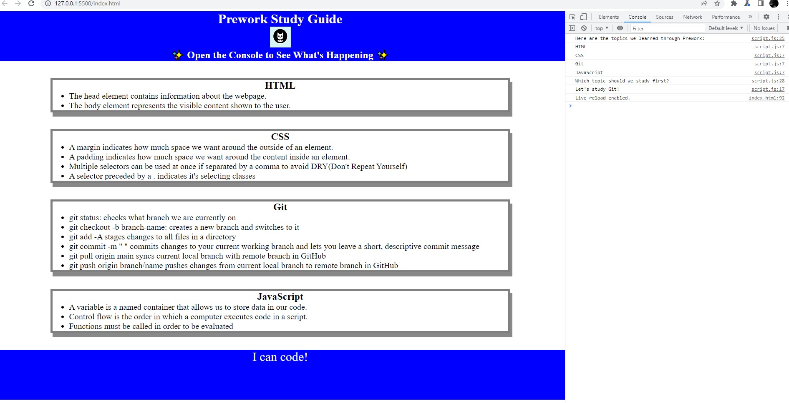

# PreWork Study Guide Webpage

## Description

This Study Guide was created to understand user stories and gain a basic understanding of HTML, CSS, git, and JS. HTML was used to provide content for the site, CSS to present that content, version control was achieved with git, and JS was used to provide interactability through the console.

## Installation

N/A

## Usage

To use this Study Guide, you can review the notes in each section. For Suggestions on what to study first, open the Chrome DevTolls by pressing Comman+Option+I (MacOS) or Control+Shift+I (Windows). A console panel should open either below or to the side of the webpage in the browser. There you will see a list of topics we learned from Prework along with a suggestion on which topic to study first.

## Credits

N/A

## License

Please refer to the LICENSE in the repo
---